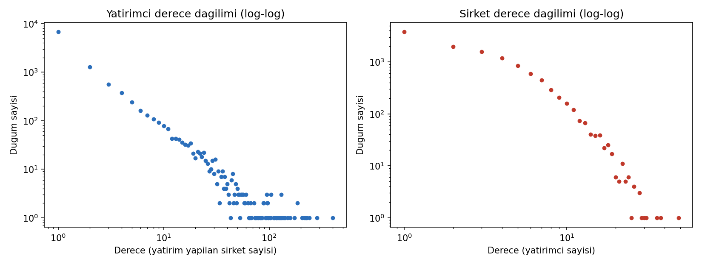
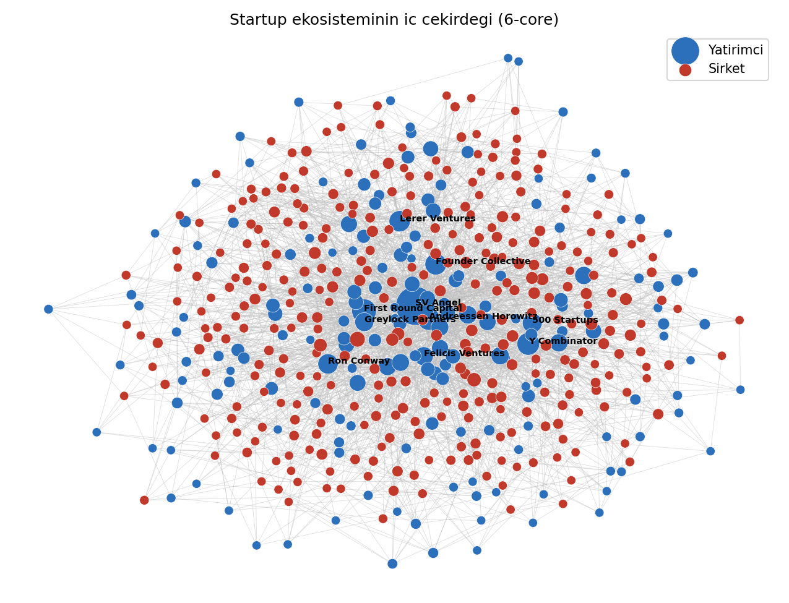
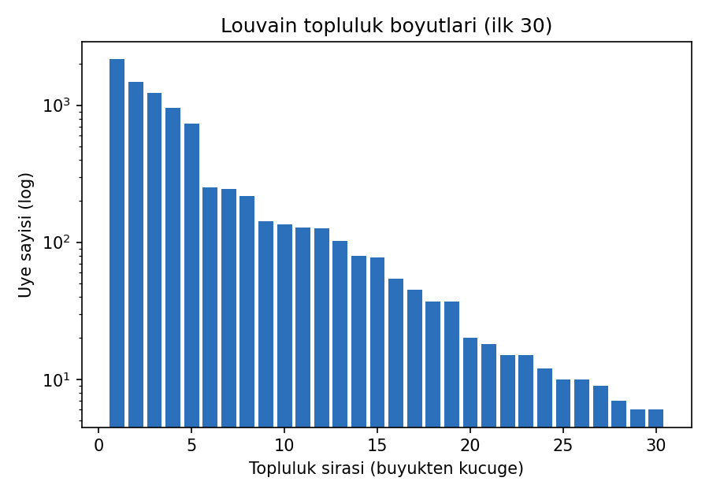

# Startup Investment Network Analysis

**Modeling the global startup ecosystem as a social network** — a bipartite investor↔company
graph built from **52,868 Crunchbase investment records**, analyzed with centrality, small-world,
core–periphery and community-detection methods.

> 🔗 **Live interactive explorer:** _coming soon (GitHub Pages)_ · 📄 [Full report (PDF)](report/projeraporu_221101064_Ali_Hakan_Kincal.pdf)

Course project for **BİL403 — Social Networks**, Ali Hakan Kıncal.

---

## Research questions

1. **Structure** — What is the basic shape of the investor–company network?
2. **Classic patterns** — Does it show a heavy-tailed degree distribution, a giant component, and small-world behavior?
3. **Central actors** — Which investors sit at the center of the ecosystem?
4. **Communities** — Do investors organize into meaningful clusters (by stage? by geography)?

## The network at a glance

| Metric | Value |
| ------ | ----- |
| Investment records | 52,868 |
| Investors / Companies | 10,552 / 11,572 |
| Dual-role entities (both investor **and** startup) | 92 |
| Graph type | undirected, weighted, **bipartite** affiliation network |
| Nodes / Edges | 22,124 / 40,978 |
| Bipartite density | 0.00034 (extremely sparse) |
| Avg degree (investor / company) | 3.88 / 3.54 |
| Max degree | **399** (SV Angel) / 49 |
| Bipartite clustering | 0.314 |
| Connected components | 1,316 |
| Giant component | 18,559 nodes (**83.9%**) |
| Avg shortest path (sampled) | **6.04** — "six degrees" |
| Estimated diameter | 17 |
| Degree assortativity | −0.136 (hubs link to small players) |
| Max k-core | 6 |
| Louvain communities / modularity | 54 / **0.441** |

## Key findings

**Heavy-tailed by nature.** The median investor backs a single company, while SV Angel invests in
399. An MLE power-law fit gives an exponent between 1.8 and 2.0 — the classic signature of a
*rich-get-richer* preferential-attachment process.



**A small world with a dense core.** Despite the sparsity, 84% of all nodes fall into one giant
component with an average shortest path of ~6. A k-core decomposition reveals a sharp
**core–periphery** structure: the innermost **6-core holds just 516 nodes** — Y Combinator,
500 Startups, First Round Capital, Andreessen Horowitz and other Silicon Valley players. This is
where the ecosystem's heart beats.



**Communities are not random.** On the investor co-investment projection, Louvain finds 54
communities (modularity 0.44) organized along **stage and geography** axes: a late-stage corporate-VC
cluster, a Silicon Valley seed cluster, and self-contained Techstars / 500 Startups ecosystems.



## Most central investors

Ranked within the 6-core by degree, betweenness, PageRank and coreness:

| Investor | Degree | Total invested ($B) | Betweenness (M) | PageRank (×1000) | Coreness |
| -------- | -----: | ------------------: | --------------: | ---------------: | -------: |
| SV Angel | 399 | 1.79 | 13.78 | 1.59 | 6 |
| New Enterprise Associates | 283 | 9.69 | 9.65 | 4.38 | 6 |
| Techstars | 241 | 0.07 | 7.59 | 0.69 | 6 |
| Intel Capital | 228 | 4.70 | 9.44 | 2.69 | 6 |
| Kleiner Perkins Caufield & Byers | 225 | 11.22 | 7.27 | 4.39 | 6 |
| 500 Startups | 221 | 0.44 | 9.41 | 1.38 | 6 |
| Sequoia Capital | 215 | 6.04 | 5.04 | 3.09 | 6 |
| Draper Fisher Jurvetson (DFJ) | 206 | 4.50 | 7.83 | 2.62 | 6 |
| Accel Partners | 186 | 6.47 | 4.50 | 3.04 | 6 |
| First Round Capital | 186 | 1.92 | 5.21 | 1.58 | 6 |

## Method notes

- **Bipartite modeling.** Investors on one side, companies on the other; edge weight = total capital
  invested. The 92 corporate-VC entities that appear in *both* roles are split into separate
  `INV::` / `CO::` nodes — the standard approach for affiliation networks, so the bipartite structure
  is preserved.
- **Computation.** Path lengths were estimated by sampling; betweenness was computed exactly.
  Analysis primarily used `igraph` for speed, with `networkx` for the bipartite pipeline.

## Repository layout

```
notebook/   projekod_...ipynb   full analysis notebook
            build_graph.py      standalone graph-construction pipeline
data/       summary_stats.json  all computed network metrics
            top10_investors.csv central-investor ranking
report/     *.png               figures
            *.pdf / *.docx      written report
            *.pptx              presentation
```

## Reproduce

```bash
pip install -r requirements.txt

# 1. Download the raw data (Crunchbase October 2013 open dump, CC-BY-NC)
#    https://github.com/dsagal/crunchbase-october-2013
# 2. Fix legacy Mac line endings (CR -> LF) into crunchbase-investments-fixed.csv
# 3. Build the graph, figures and summary stats:
cd notebook && python build_graph.py
```

## Data & license

Data: **Crunchbase October 2013** open dump ([source](https://github.com/dsagal/crunchbase-october-2013)),
licensed CC-BY-NC. This repository's code is released under the MIT License.
